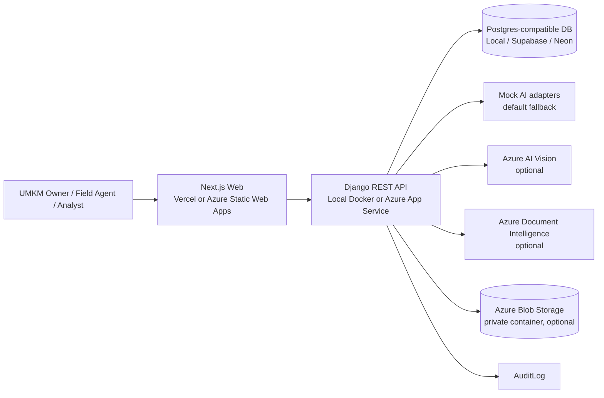

# Architecture

MitraScore AI is a Django REST API plus Next.js web client. It keeps mock mode stable for local demos and adds optional Azure adapters behind the existing AI and storage interfaces.

## Backend Apps

- `accounts`: email-based users with `UMKM_OWNER`, `FIELD_AGENT`, `ANALYST`, and `ADMIN` roles.
- `borrowers`: borrower profiles, consent records, workflow states, analyst case views.
- `evidence`: upload validation, local/Blob storage metadata, evidence source labels, extraction results.
- `scoring`: Instant Evidence Check and Credit Readiness Review.
- `audit`: workflow and AI processing logs.
- `ai_services`: mock clients plus optional Azure Vision and Document Intelligence clients.

## Azure Service Mapping

| Product area | Local default | Azure optional |
| --- | --- | --- |
| Business photo analysis | `MockVisionClient` | Azure AI Vision through Azure AI services |
| OCR/document extraction | `MockDocumentIntelligenceClient` | Azure AI Document Intelligence |
| Field note summary | `MockLanguageClient` | Future Azure AI Language or Azure OpenAI adapter |
| Evidence search/policy context | `MockSearchClient` | Future Azure AI Search adapter |
| Evidence files | Django local media | Azure Blob Storage private container |
| Database | SQLite/Postgres | Supabase/Neon/Postgres-compatible demo DB |

Azure AI Language, Azure OpenAI, Azure AI Search, Azure PostgreSQL, Container Apps, AKS, GPU, and Azure ML compute are not required.

## Adapter Selection

`USE_MOCK_AI=true` is the default. In this mode all evidence processing uses deterministic mock clients.

When `USE_MOCK_AI=false`:

- `BUSINESS_PHOTO` evidence uses `AzureVisionClient` if `AZURE_AI_VISION_ENDPOINT` and `AZURE_AI_VISION_KEY` exist.
- Receipt, invoice, supplier note, sales note, QRIS screenshot, and other document evidence use `AzureDocumentIntelligenceClient` if `AZURE_DOCUMENT_INTELLIGENCE_ENDPOINT` and `AZURE_DOCUMENT_INTELLIGENCE_KEY` exist.
- Missing credentials or Azure request failure creates a failed extraction result, records audit logs, and returns a clear fallback message instead of crashing.

## Data Flow

1. User logs in with JWT.
2. Borrower profile is created or loaded.
3. Consent is recorded before evidence upload or scoring.
4. UMKM owner uploads evidence, or a field agent uploads assisted/verified evidence.
5. Uploads are validated by extension, MIME type, and size.
6. File is saved locally by default. If Blob mode is enabled and configured, the app uploads a private blob and records the blob name without generating a public URL.
7. Evidence processing runs mock or Azure adapter based on configuration.
8. Instant Evidence Check determines data sufficiency.
9. Eligible cases are submitted to analyst queue.
10. Analyst runs DeepScore Review and records a human decision.
11. Audit logs capture consent, upload, AI processing, Blob attempts, scoring, submission, and decision updates.

## Security Flow

- UMKM owners can access only their own profiles.
- Field agents can access only assigned or created cases.
- Analysts can list and open only submitted/reviewed cases.
- Analysts cannot upload or process evidence.
- Final declined or approved cases are locked for normal owner/field-agent edits.
- CORS is environment-based.
- Production must use `DJANGO_DEBUG=0`.
- Secrets are provided only through environment variables.

## Responsible AI Flow

- Consent-first design.
- No face recognition.
- No protected attribute scoring.
- No personal appearance, ethnicity, religion, gender, lifestyle, home luxury, social media, or unrelated contact data as credit signals.
- Vision extracts only business-relevant indicators such as storefront context, stock/product presence, signage text, quality flags, and confidence.
- Document Intelligence extracts OCR text, amount, date, merchant/supplier text, item-like lines, confidence, and low-quality flags.
- DeepScore is deterministic decision-support. It never records approval or rejection by AI.

## Deployment Diagram

## Future Optional Extensions

- Azure AI Language or Azure OpenAI can summarize field notes with strict prompts: no automatic decisions, no sensitive attribute scoring, uncertainty must be explained, and human review is required.
- Azure AI Search can index policy/evidence context later. The current MVP keeps evidence search mocked to avoid paid-tier requirements.
- A production database can use Azure Database for PostgreSQL later, but it is not required for the hackathon-safe setup.
